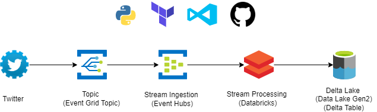

# Terraforming Azure
Real-time ingestion of tweets into Databricks Delta table with a CI/CD pipeline to provision infrastructure in Azure. Shows how Terraform can be used to set up the resources.  

# General 
Ingested tweets into an Event Grid topic in Azure on a real-time basis; subscribed an Event Hubs to the topic so that the streams get routed into Event Hubs. Processed the incoming streams using Databricks structured streaming, and finally stored them into a Databricks Delta Table, a next generation storage solution in the cloud. 

# Cloud Architecture

